# Rapport — TP Final CI/CD
---

## 1. Contexte

Une entreprise souhaite automatiser le déploiement de son application web pour gagner du temps et éviter les erreurs humaines. L'objectif du TP est de couvrir l'ensemble de la chaîne DevOps sur un projet simple :

- Containeriser une application multi-service.
- Orchestrer les services avec Docker Compose (local) et Kubernetes (prod).
- Provisionner automatiquement l'infrastructure cloud (AWS).
- Mettre en place un pipeline CI/CD de bout en bout (GitHub Actions).
- Gérer proprement les variables et secrets.
- Monitorer la plateforme.

---

## 2. Solution retenue

| Élément | Choix | Justification |
|---|---|---|
| Application | API Node.js (Express) + MongoDB | Deux services qui communiquent, léger pour K8s local |
| Conteneurisation | Docker (multi-stage) + Docker Compose | Image finale < 150 Mo, orchestration locale simple |
| Cloud | AWS EC2 (`t3.small`, Ubuntu 22.04) | Free tier éligible, écosystème Terraform mature |
| K8s local | K3s | Installation 1 ligne, très léger (< 512 Mo RAM) |
| Registry | GHCR | Gratuit et intégré à GitHub Actions (GITHUB_TOKEN) |
| CI/CD | GitHub Actions | Intégré au dépôt, pas d'infra supplémentaire |
| IaC | Terraform | Reproductible et déclaratif |
| Monitoring | kube-prometheus-stack (Helm) | Stack de référence, ServiceMonitor natif |
| Bonus managé | AWS EKS (via module Terraform) | Démontre la capacité à déployer aussi sur un K8s managé |

### Architecture

```
Développeur ── git push ──▶ GitHub Actions (test → build → push → deploy)
                                   │
                                   ▼
                        AWS EC2 (K3s cluster)
                        ├── api × 2 (Deployment)
                        ├── mongo (StatefulSet)
                        ├── Ingress Traefik (port 80)
                        └── Prometheus + Grafana (monitoring)
```

---

## 3. Étapes réalisées & preuves

> Chaque capture est placée dans `docs/screenshots/`.

### 3.1 Application & tests

- Code : `app/src/server.js`, routes `/health`, `/api/items`, `/metrics`.
- Tests Jest + Supertest (5 tests) : `app/tests/server.test.js`.

**Preuve** : 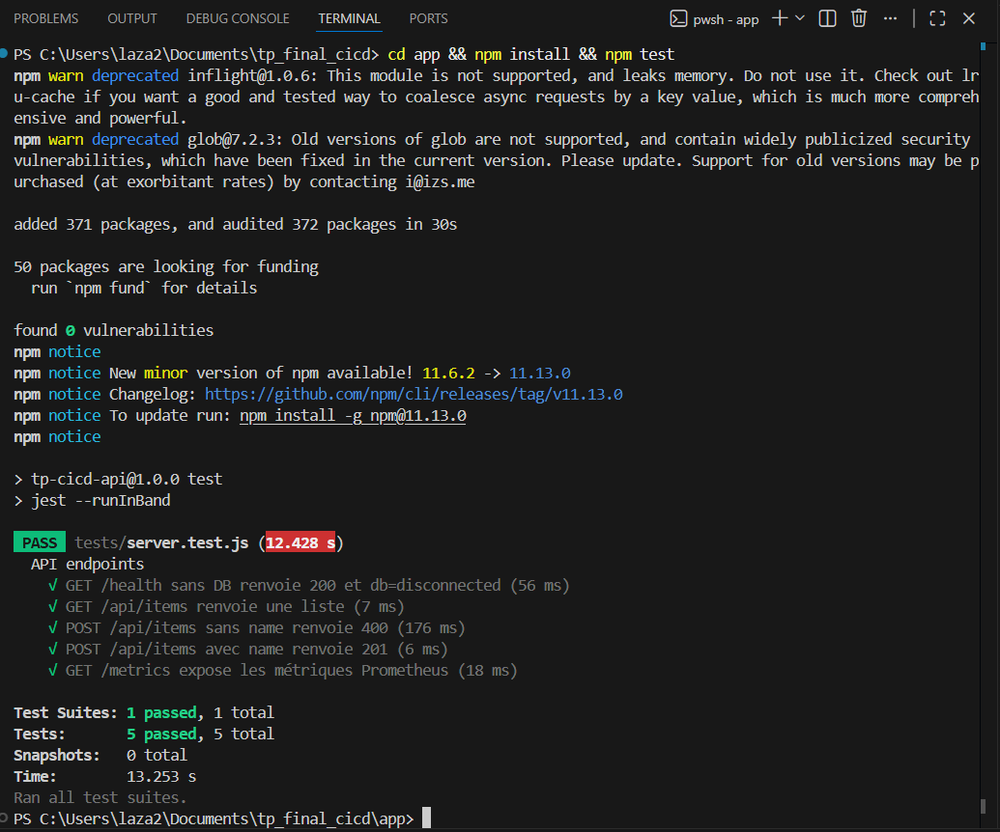

### 3.2 Docker & Docker Compose (multi-stage)

- `app/Dockerfile` : 2 étapes (builder → runtime), utilisateur non-root, `tini` comme init.
- `docker-compose.yml` : services `api` + `mongo`, healthcheck, réseau dédié.
- Vérification : `docker compose up --build`.

**Preuves** :
- 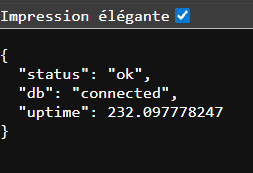
- 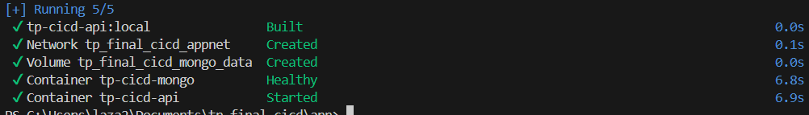
- 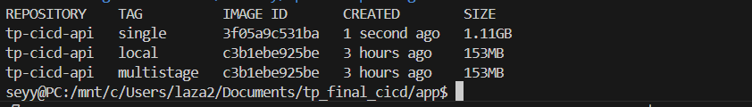

### 3.3 Manifests Kubernetes

- Namespace, ConfigMap, Secret (template), StatefulSet Mongo, Deployment API (×2 replicas, probes `/health`), Service NodePort, Ingress Traefik.

### 3.4 Provisioning Terraform (VM + VPC + SG + EKS)

- VPC 10.0.0.0/16, 2 subnets publics multi-AZ.
- EC2 `t3.small` avec `user_data` : Docker + K3s + kubectl + Helm installés automatiquement.
- Security Group : 22 (SSH), 80 (HTTP), 443, 6443 (K3s API), 30000-32767 (NodePort).
- Module `terraform-aws-modules/eks/aws` derrière un flag `enable_eks`.

**Preuves** :
- 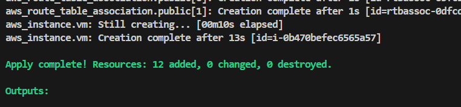
- 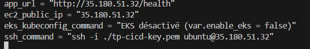

### 3.5 Déploiement K3s sur la VM

- `kubectl get nodes` → 1 nœud `Ready`.
- `kubectl get pods -n tp-cicd` → tous `Running`.
- Accès navigateur : `http://<IP_VM>/health`.

**Preuves** :
- 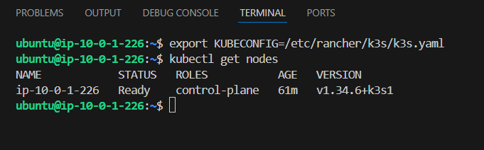
- 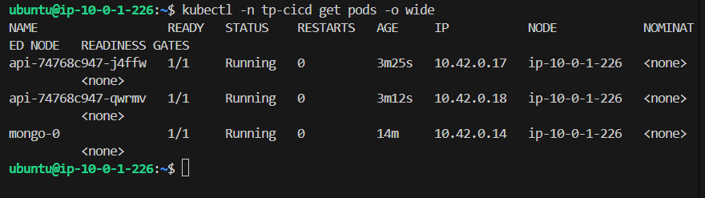
- 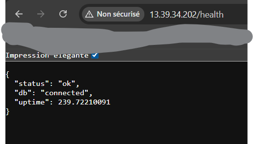

### 3.6 Pipeline CI/CD (GitHub Actions)

3 jobs chaînés :
1. `test` — `npm ci` + `npm run test:ci`
2. `build-push` — `docker buildx build --push` vers `ghcr.io/<owner>/tp-cicd-api:sha-<commit>` + `latest`
3. `deploy-vm` — SSH vers EC2, `kubectl apply -f k8s/`, `kubectl set image`, `kubectl rollout status`

**Preuves** :
- 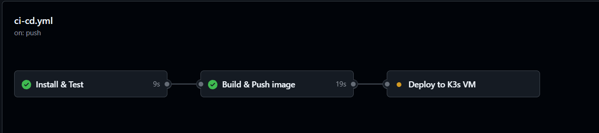
- 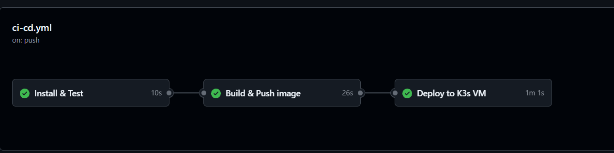

### 3.7 Secrets & variables d'environnement

- **Code** : aucun secret. `.env.example` committé, `.env` gitignoré.
- **GitHub** : 6 secrets (`EC2_HOST`, `EC2_USER`, `EC2_SSH_KEY`, `MONGO_USER`, `MONGO_PASSWORD`, `GHCR_PULL_TOKEN`).
- **Kubernetes** : `Secret` créé par la CI via `kubectl create secret ... --dry-run=client -o yaml | apply -f -` (jamais committé).
- **Terraform** : `terraform.tfvars` et `*.pem` gitignorés.

### 3.8 Bonus 1 — Multi-stage build

Comparaison tailles :
- Single-stage (FROM node:20) : ~1,1 Go
- Multi-stage (alpine, prod deps) : ~140 Mo
- Gain : **~87 %**.

**Preuve** : 

### 3.9 Bonus 2 — Terraform pour la VM

Toute l'infra (VPC + subnets + IGW + route table + SG + EC2 + key pair + user_data) est codée dans `terraform/`. Un seul `terraform apply` suffit ; `terraform destroy` nettoie tout.

### 3.10 Bonus 3 — Monitoring Prometheus + Grafana

- `monitoring/install.sh` installe `kube-prometheus-stack` via Helm.
- `k8s/servicemonitor.yaml` déclare le scrape de `/metrics`.
- Dashboard custom importé (`monitoring/dashboards/api-dashboard.json`) : requêtes/s, latence p95, erreurs 5xx.

**Preuves** :
- 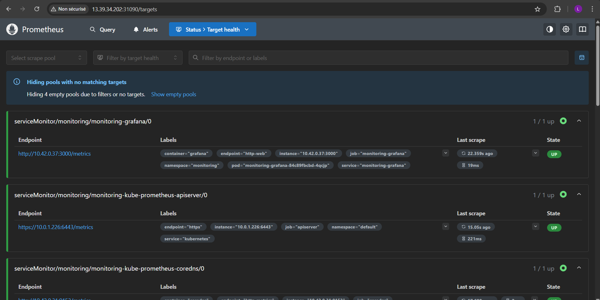
- 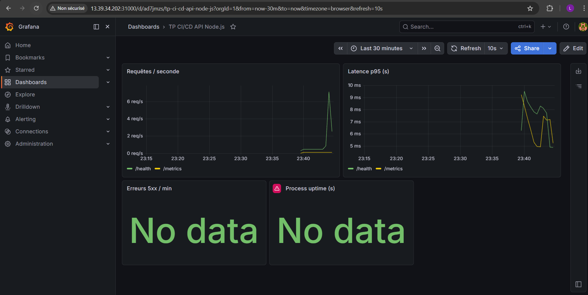

### 3.11 Bonus 4 — Cluster Kubernetes managé (EKS)

Module `terraform-aws-modules/eks/aws` activé par `enable_eks = true`. Mêmes manifests appliqués, démontrant la portabilité de la plateforme.

**Preuve** : 

---

## 4. Captures d'écran à fournir

| # | Fichier | Comment l'obtenir |
|---|---|---|
| 01 | `01_docker_compose_up.png` | `docker compose up` + `docker compose ps` + `curl localhost:3000/health` |
| 02 | `02_tests_passing.png` | `cd app && npm test` (5 tests verts) |
| 03 | `03_image_build.png` | `docker images tp-cicd-api` après build |
| 04 | `04_ghcr_packages.png` | Onglet Packages du dépôt GitHub |
| 05 | `05_terraform_apply.png` | Sortie `terraform apply` avec outputs |
| 06 | `06_ec2_running.png` | Console AWS EC2 (instance running) |
| 07 | `07_k3s_nodes.png` | `sudo kubectl get nodes` sur la VM |
| 08 | `08_k8s_pods.png` | `sudo kubectl get pods -n tp-cicd` |
| 09 | `09_app_live.png` | Navigateur `http://<IP_VM>/health` |
| 10 | `10_github_actions.png` | Onglet Actions, run complet vert |
| 11 | `11_deploy_auto.png` | Détail job deploy-vm (rollout status) |
| 12 | `12_prometheus.png` | `http://<IP>:31090/targets` (target `api` UP) |
| 13 | `13_grafana_dashboard.png` | `http://<IP>:31000` dashboard importé |
| 14 | `14_eks_cluster.png` | Console AWS EKS + `kubectl get nodes` |
| 15 | `15_multi_stage_size.png` | `docker images` comparant multi-stage vs single-stage |

---

## 5. Bilan

La chaîne complète est opérationnelle :
- `git push main` → tests → build image → push GHCR → déploiement automatique sur K3s → healthcheck OK.
- L'infrastructure est reproductible en une commande (`terraform apply`).
- La plateforme est monitorée (Prometheus + Grafana).
- Aucun secret n'est présent dans le code.

Bonus réalisés : **4/4** (multi-stage, Terraform, monitoring, EKS managé).
